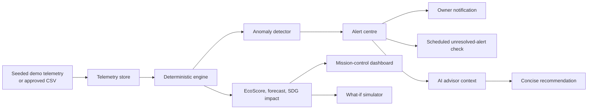

# EcoSphere AI Architecture

## Design principle

EcoSphere AI uses a deterministic sustainability engine for all numerical work. The AI advisor receives a bounded telemetry context and explains the outcome; it does not calculate, alter, or invent sustainability values.

## Runtime components

| Layer | Responsibility | Key files |
| --- | --- | --- |
| Interface | Responsive campus mission control, demo controls, trend chart, simulator, alerts, advisor, and source readiness. | `client/src/pages/Home.tsx` |
| API boundary | Typed client–server procedures that expose dashboard state and controlled actions. | `server/routers.ts`, `server/routers/sustainability.ts` |
| Sustainability engine | Seed creation, EcoScore, anomaly detection, forecasting, simulations, alerts, CSV import, and scheduled follow-up logic. | `server/sustainability.ts`, `shared/sustainability.ts` |
| Persistence | Campus, telemetry, alert, data-source, monitoring-setting, and scenario records. | `drizzle/schema.ts` |
| Scheduler callback | Authenticates platform cron calls and runs idempotent unresolved-alert checks. | `server/scheduledMonitoring.ts`, `server/_core/index.ts` |
| Advisor | Supplies the language model with a narrow, current state envelope and has a deterministic fallback. | `server/routers/sustainability.ts` |

## Data model

| Entity | Purpose | Primary fields |
| --- | --- | --- |
| `campuses` | Identifies a campus pilot and operating mode. | `slug`, `name`, `location`, `mode` |
| `telemetry` | Captures timestamped resource observations. | `metric`, `value`, `unit`, `source`, `isSimulated`, `capturedAt` |
| `sustainabilityAlerts` | Records detectable operational incidents. | `severity`, `status`, `observedValue`, `threshold`, `recommendedAction` |
| `monitoringSettings` | Stores notification preferences and scheduled-job identity. | `highSeverityNotifications`, `scheduleMinutes`, `scheduleCronTaskUid` |
| `dataSources` | Creates a controlled boundary for CSV, sensor, and API integrations. | `sourceType`, `status`, `approved`, `fieldMapping` |
| `sustainabilityScenarios` | Provides a persistence target for future saved interventions. | conservation inputs and projected outputs |

## Deterministic calculation contract

EcoScore is a weighted index of energy (34%), water (22%), waste (18%), and carbon (26%) sub-scores. Each component is clamped between 0 and 100. The current prototype baseline is intentionally visible in source code and tests so judges can trace any output.

The anomaly detector compares a new energy observation to the mean of the preceding eight energy readings. It creates an anomaly when the ratio reaches **1.25** or more. The controlled HVAC scenario writes the simulated observation, derives calculated carbon, creates a high-severity alert, and proposes an inspection action.

The what-if simulator uses declared prototype demo constants: 0.71 kgCO₂e/kWh and ₹9.80/kWh. It calculates avoided energy, carbon, cost, and a bounded EcoScore lift. These values are supplied to the UI and advisor as outputs, rather than being generated by a language model.

## Alert and notification lifecycle

1. The engine persists a controlled anomaly and checks the deterministic threshold.
2. A high-severity alert opens only if a matching unresolved alert does not already exist.
3. If owner notifications are enabled, the backend attempts a project-owner notification and records a successful delivery time.
4. The scheduled callback rechecks unresolved high- or critical-severity incidents. It is idempotent and avoids repeated notifications within 15 minutes.
5. Operators can acknowledge or resolve the incident. Resolution sets `resolvedAt` and stops follow-up notification.

## Scheduled monitoring activation

The project is prepared for a 5, 10, 15, 30, or 60 minute schedule. The procedure persists the platform-generated task UID on `monitoringSettings`; the callback authenticates using that UID rather than trusting request body data. Activation must occur after publication, because the scheduling platform must call a stable deployed endpoint.

## Production hardening path

Before operational deployment, replace demo constants with an approved campus calculation policy, introduce source-specific validation and authorization, add role restrictions to ingestion and scheduler configuration, conduct security review of partner APIs, and configure a documented notification escalation policy.
